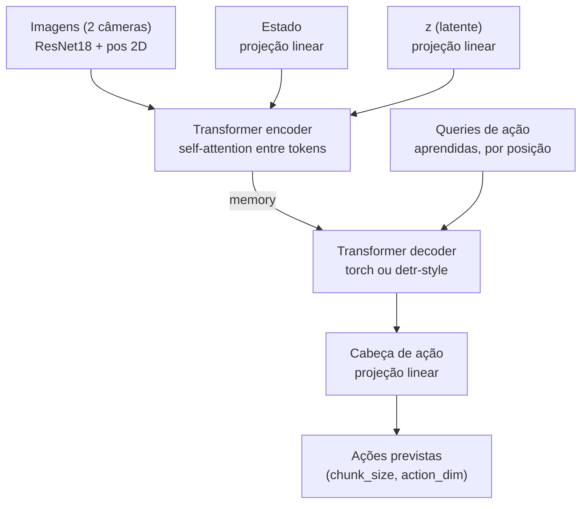
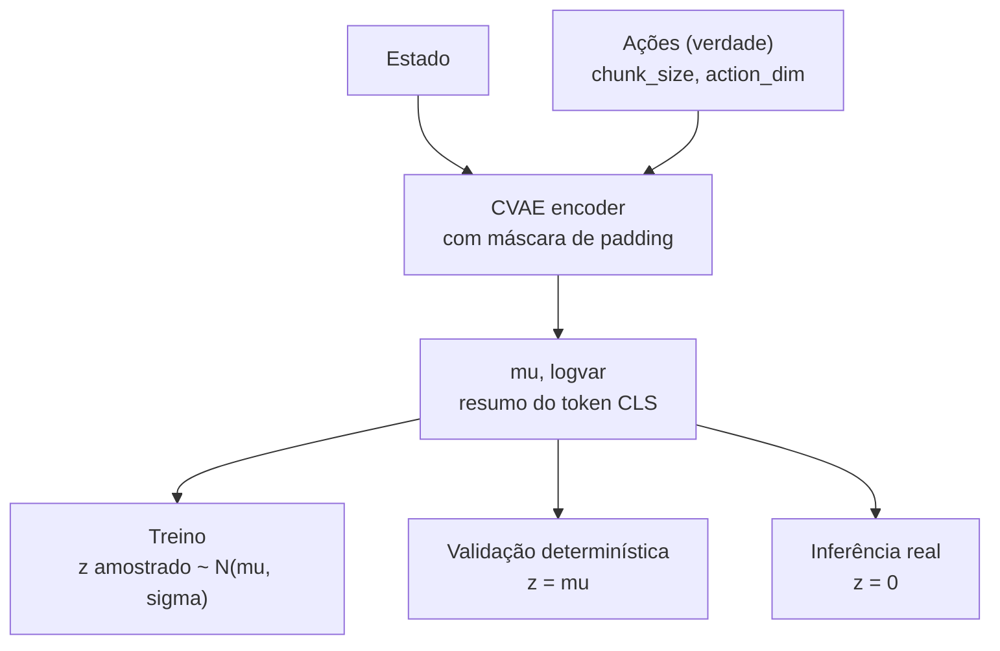
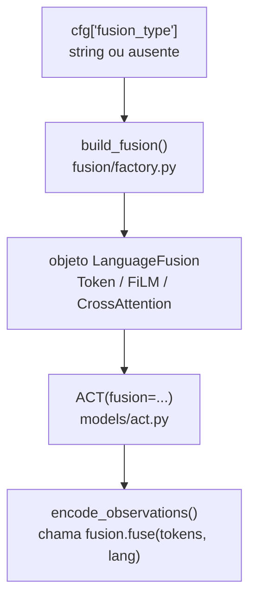
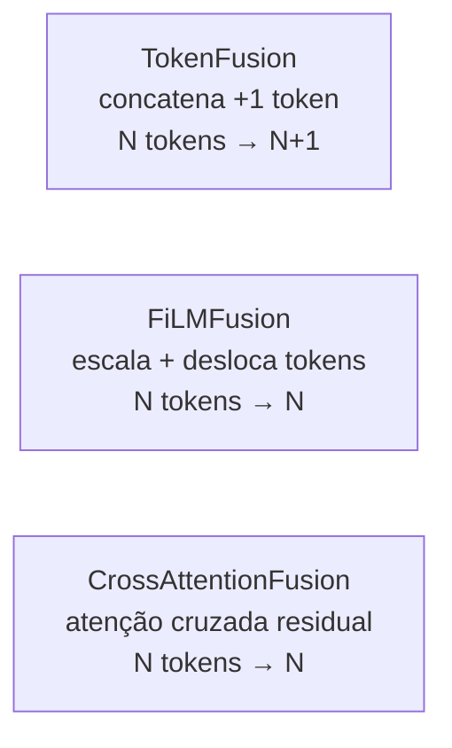
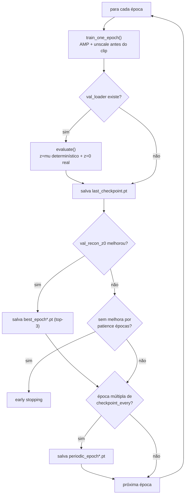

# Arquitetura e loop de treinamento

Este documento explica **como o código funciona por dentro** — a arquitetura do
ACT bloco a bloco, e a lógica do loop de treinamento. Para instalação, uso no
Colab/local e a lista de correções aplicadas em relação ao notebook original,
veja o [README](README.md).

Os diagramas usam sintaxe Mermaid — renderizam automaticamente ao ver este
arquivo no GitHub.

## 1. Arquitetura do ACT

### 1.1 Caminho de inferência (roda sempre, treino e rollout)



**Imagens (2 câmeras).** Cada câmera (`agentview` e `wrist`) passa pelo
*mesmo* `ResNet18` — pesos compartilhados, não um backbone por câmera. A
saída é um mapa de features que é achatado em tokens (uma posição espacial
= um token), com a codificação posicional 2D senoidal somada, para cada
token "saber" onde está na imagem. A normalização ImageNet (`mean`/`std` do
`IMAGENET1K_V1`) vive dentro do próprio `VisionBackbone` como buffer — viaja
com o checkpoint, elimina a classe de bug "esqueci de normalizar no
rollout".

**Estado** e **z (latente).** Dois vetores pequenos (8-dim e 32-dim no
config padrão), cada um projetado por uma `nn.Linear` própria para virar
exatamente **1 token**. Cada um ganha também um embedding posicional
dedicado (`extra_pos_embed`, 2 posições) — sem isso, o transformer não
teria como distinguir o token de estado do token de z pela posição, só
pelo conteúdo.

**Transformer encoder.** Todos os tokens (imagem × 2 câmeras + estado + z)
entram juntos aqui e se misturam via self-attention. A saída é chamada de
`memory` no código — é o resumo de "o que está acontecendo agora" que o
decoder vai consultar. **É logo antes deste bloco que a fusão de linguagem
se encaixa** (seção 1.3): o `fuse()` de cada mecanismo modifica os tokens
antes de entrarem aqui.

**Queries de ação.** Não vêm da observação — são parâmetros aprendidos e
fixos, um por posição do chunk (`chunk_size=50` por padrão). Funcionam como
perguntas ao `memory`: "qual é a ação no passo `k` deste chunk?".

**Transformer decoder.** As queries fazem self-attention entre si (permite
que a ação do passo 30 "saiba" o que a do passo 10 já decidiu — coerência
do chunk inteiro) e cross-attention para o `memory` (busca a informação
visual/de estado relevante). `decoder_style="torch"` injeta a posição uma
única vez, na entrada; `decoder_style="detr"` reinjeta em cada camada (ver
seção 1.4).

**Cabeça de ação.** Uma `nn.Linear` simples, aplicada token a token,
convertendo cada uma das 50 posições decodificadas no vetor de ação final
(`action_dim`, 7 no LIBERO).

### 1.2 O ramo do CVAE encoder (só existe no treino)

O `z` que entra no diagrama acima não nasce do nada — ele vem de um
transformer **separado**, que só roda durante o treino:



O `CVAEEncoder` recebe o estado e as ações **verdadeiras** (só disponíveis
no treino — no rollout real não existem ações futuras pra consultar) e
resume tudo num único token `[CLS]`, que vira `mu` e `logvar`.

As ações de padding (fim de episódio) são mascaradas via
`src_key_padding_mask` — sem isso, o `[CLS]` resumiria ações repetidas
artificialmente perto do fim do episódio, enviesando `z`.

O que muda entre os três ramos é **qual `z`** volta para o diagrama da
seção 1.1:

| Modo | z | Quando é usado |
|---|---|---|
| Treino | amostrado de `N(mu, sigma)` via reparametrização | `train_one_epoch`, permite gradiente fluir pela amostragem |
| Validação determinística | `z = mu` | `evaluate()`, mede o modelo sem o ruído da amostragem |
| Inferência real | `z = 0` (média do prior) | `evaluate()` (como `recon_z0`) e todo rollout — nunca há ações verdadeiras disponíveis pra consultar |

`val_recon_z0` — calculado no modo "inferência real" — é o critério de
seleção de checkpoint e de early stopping, porque é o único, dos três, que
mede exatamente o que o modelo faz sozinho no ambiente.

**Diagnóstico `mu_abs_mean`.** `mu.abs().mean()` é rastreado a cada época,
treino e validação. Se ficar perto de zero, o posterior colapsou — os
ramos "treino" e "inferência real" produzem, na prática, o mesmo `z`. Foi
o que aconteceu no LIBERO tarefa única (pouca variação de estilo entre as
demonstrações para o `z` explicar).

### 1.3 Ponto de injeção da fusão de linguagem (Fase 3)

Todo mecanismo implementa a interface `LanguageFusion`
(`models/fusion/base.py`): `encode_text(texts) -> vetor` e
`fuse(obs_tokens, lang) -> obs_tokens modificado`, chamado logo antes do
transformer encoder principal (seção 1.1). Com `fusion=None` (Fases 1 e 2),
nada disso é usado — é o baseline exato.

**Do config ao modelo.** `cfg["fusion_type"]` é uma string (`"token"`,
`"film"`, `"cross_attn"` ou ausente); `build_fusion()` a traduz no objeto
certo via um dicionário de despacho:



```python
# fusion/factory.py
FUSION_REGISTRY = {"token": TokenFusion, "film": FiLMFusion, "cross_attn": CrossAttentionFusion}

def build_fusion(fusion_type, d_model, **kwargs):
    if fusion_type is None:
        return None
    return FUSION_REGISTRY[fusion_type](d_model=d_model, **kwargs)
```

```python
# models/act.py, dentro de encode_observations()
if self.fusion is not None and task_texts is not None:
    lang = self.fusion.encode_text(task_texts, device=tokens.device)
    tokens = self.fusion.fuse(tokens, lang)
```

**Os três mecanismos.** A diferença real está em como cada `fuse()`
transforma os tokens:



```python
# token.py -- o mais simples: encoder decide sozinho o que fazer com o token extra
def fuse(self, obs_tokens, lang):
    return torch.cat([obs_tokens, lang.unsqueeze(1)], dim=1)  # N -> N+1
```

```python
# film.py -- to_gamma_beta nasce ZERADO: fuse(x) = x no início do treino
# (identidade exata, o modelo se afasta disso aos poucos, sem transformação
# aleatória destrutiva desde a primeira época)
nn.init.zeros_(self.to_gamma_beta.weight)
nn.init.zeros_(self.to_gamma_beta.bias)
...
def fuse(self, obs_tokens, lang):
    gamma, beta = lang.split(self.d_model, dim=-1)
    return obs_tokens * (1 + gamma.unsqueeze(1)) + beta.unsqueeze(1)
```

```python
# cross_attn.py -- único em que tokens diferentes reagem à linguagem de
# formas diferentes (FiLM aplica a MESMA modulação em todos os tokens)
def fuse(self, obs_tokens, lang):
    attended, _ = self.cross_attn(query=obs_tokens, key=lang, value=lang)
    return self.norm(obs_tokens + attended)
```

**Encaixe com `decoder_style="detr"`.** Como `TokenFusion` muda a contagem
de tokens (N → N+1), o `memory_pos` (usado só nesse modo de decoder)
ficaria desalinhado com `memory` — por isso há um padding com zeros
específico para esse caso:

```python
if tokens.size(1) != memory_pos.size(1):
    pad = torch.zeros(batch_size, tokens.size(1) - memory_pos.size(1), self.d_model, ...)
    memory_pos = torch.cat([memory_pos, pad], dim=1)
```

É a combinação `TokenFusion` + `decoder_style="detr"` que o teste
`test_token_fusion_com_decoder_detr` trava — o único cruzamento entre
features onde uma mudança isolada em uma quebraria a outra silenciosamente.

O texto é codificado por um `sentence-transformers` **congelado**
(`all-MiniLM-L6-v2`, 384-dim), compartilhado pelos três mecanismos
(`models/fusion/text_encoder.py`), com cache por string — o vocabulário de
instruções do LIBERO é pequeno e fixo. Só a projeção que adapta o embedding
congelado para `d_model` é treinada.

### 1.4 `decoder_style`: torch vs detr (ablação opcional)

- `"torch"` (default, validado): usa `nn.TransformerDecoder` de prateleira.
  A posição (`action_queries`) é injetada uma única vez, como conteúdo do
  `tgt`.
- `"detr"`: decoder escrito à mão (`models/decoder_detr.py`), fiel ao DETR
  original — `tgt` começa em zero, `action_queries` vira *apenas* posição
  (`query_pos`), reinjetada em q/k de cada camada (nunca em v). Exige que
  o encoder também exponha `memory_pos` separado do conteúdo — por isso
  `encode_observations` devolve `(memory, memory_pos)`, não só `memory`.

Um teste (`test_default_identico_a_torch_explicito`) trava que o default
`"torch"` é **bit-a-bit idêntico** ao comportamento original — a ablação é
opt-in, nunca contamina o baseline.

## 2. Loop de treinamento

### 2.1 Fluxo de `fit()`



**Sem `val_loader`** (`fit(..., val_loader=None)`): pula inteiramente o
ramo de avaliação, early stopping e seleção de melhor checkpoint — treina
por `num_epochs` fixo, só salvando `last_checkpoint.pt` e periódicos.
Existe para datasets pequenos demais para um held-out confiável; a
avaliação de qual checkpoint é o melhor fica para rollout real, fora deste
loop.

### 2.2 Funções de perda (`training/loss.py`)

- **`masked_l1`**: L1 entre ação prevista e real, dividida **só** pelos
  elementos válidos (`~is_pad`) — não pelo total. Padding nunca contamina
  a magnitude da loss.
- **`kld_free_bits`**: KL por dimensão do latente, com `clamp(kld - free_bits, min=0)`
  antes de somar — dimensões que já estão "baratas" (abaixo do limiar) não
  geram gradiente adicional, evitando que o KL colapse o posterior de forma
  mais agressiva do que o necessário.
- **`act_loss`**: `recon + kl_weight * kld_penalizado`. Retorna também
  `kld_raw` (sem o `free_bits`), só para logging — o gradiente usa o
  penalizado, o log mostra o real.

### 2.3 Métricas rastreadas por época

| Métrica | De onde vem | Para que serve |
|---|---|---|
| `train_loss/recon/kld` | `train_one_epoch` | acompanhar convergência no treino |
| `train_mu_abs_mean` | idem | diagnóstico de colapso do posterior (treino) |
| `val_loss/recon/kld` | `evaluate`, z=mu | mesma coisa, em dados não vistos |
| `val_recon_z0` | `evaluate`, z=0 | **critério de seleção** — corresponde à inferência real |
| `val_mu_abs_mean` | `evaluate` | diagnóstico de colapso do posterior (validação) |

`evaluate()` faz os dois forwards (z=mu e z=0) **numa única passada** pelo
`val_loader` — decodifica cada vídeo de validação uma vez, não duas.

### 2.4 Seleção de checkpoint e resume

- Top-3 checkpoints por `val_recon_z0` são mantidos em disco
  (`save_top_k_checkpoint`); o pior do top-3 é apagado quando um novo
  entra.
- `load_checkpoint` devolve `epoch + 1` como `start_epoch` — resumir não
  re-executa a última época já salva (era um off-by-one no notebook
  original).
- `history` é construído via `setdefault`, não chaves fixas — resumir de
  um checkpoint salvo por uma versão anterior do código (schema de
  métricas diferente, ex: sem `mu_abs_mean`) não quebra; a chave nova só
  passa a existir a partir da época em que o código já a tinha.

## 3. Correspondência com o código

| Bloco | Arquivo |
|---|---|
| Backbone visual + projeções de estado/z | `models/backbone.py`, `models/act.py` (`encode_observations`) |
| CVAE encoder | classe `CVAEEncoder` em `models/act.py` |
| Transformer encoder/decoder principal | `models/act.py` (`transformer_encoder`, `transformer_decoder`) |
| Decoder estilo DETR (ablação) | `models/decoder_detr.py` |
| Codificação posicional (1D e 2D) | `models/positional.py` |
| Fusão de linguagem (interface + 3 mecanismos + factory) | `models/fusion/` (`base.py`, `token.py`, `film.py`, `cross_attn.py`, `text_encoder.py`, `factory.py`) |
| Perdas | `training/loss.py` |
| Loop de treino/avaliação | `training/loop.py` |
| Checkpoints | `training/checkpoints.py` |
| Optimizer (LR duplo) | `training/optim.py` |
| Pipeline de dados (filtro, splits) | `data/libero.py` |
| Normalização | `data/normalize.py` |
| Conversões de observação do ambiente | `eval/obs_processing.py` |
| Rollout + temporal ensembling | `eval/rollout_libero.py` |
| Detecção de ambiente, device, checkpoint_dir | `utils/runtime.py` |

Para a lista completa de correções aplicadas em relação ao notebook
original (com justificativa de cada uma), veja a tabela no
[README](README.md#correções-aplicadas-em-relação-ao-notebook-original-v1).
